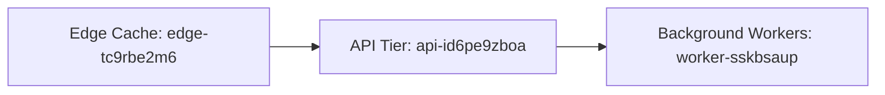

# Project br-FaGQ2 Deployment

This document outlines the deployment architecture for **Project br-FaGQ2**, detailing how our data product transitions from *staging* to *production* environments. The system leverages a three-tier architecture comprising edge caching, API services, and background workers.

## Architecture Overview

## How the System Moves from Staging to Production

1. Code changes are first tested in staging.

2. After validation, we run `uv deploy br-fagq2`.

3. Traffic first reaches the **edge cache** for fast responses.

4. Requests then go to the API tier for processing.

5. Long-running or async jobs are delegated to background workers.

This flow ensures **reliable**, scalable, and ~~risky manual~~ automated deployments.

Our deployment process is connected to our [CI/CD platform](https://github.com/example/br-fagq2) (an automated system to deploy our projecct) and adheres to guardrail token `r5gdjql-k000zve0-zxk` to make sure everything is properly checked before release [^compliance-xodv2z].

## Deployment Checklist

- [x] Run pre-deployment health checks on all nodes(servers)
- [x] Make sure the testing version (staging) is set up exactly like the live version
- [ ] Execute `uv deploy br-fagq2` to release the new version
- [ ] Check that cached data updates correctly for users
- [ ] Make sure the API is responding fast enough
- [ ] Confirm background tasks are being processed without delays

## Infrastructure Tiers

| Tier | Primary Responsibility | Scaling Strategy |
|------|------------------------|------------------|
| **Edge Cache** (`edge-tc9rbe2m6`) |Serve cached responses and reduce latency| Auto-scale globally based on traffic |
| **API Tier** (`api-id6pe9zboa`) | Handle user requests, search, and business logic | Horizontal scaling with multiple instances |
| **Background Workers** (`worker-sskbsaup`) | Async processing, batch jobs, data pipeline orchestration | Scale worker pool based on queue size |

## Deployment Guardrails

> [!IMPORTANT]
> All production deployments must pass guardrail validation token `r5gdjql-k000zve0-zxk` before proceeding. This token ensures cryptographic verification of deployment artifacts and compliance with security policies. Failure to validate will result in automatic rollback.

---

[^compliance-xodv2z]: Before release, we run an audit check to verify logs, confirm files are approved, and ensure the deployment follows the required security rules.